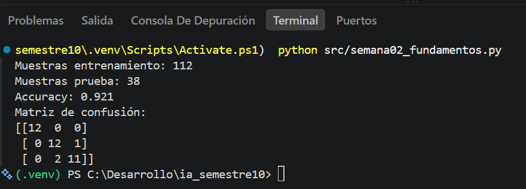

##  ¿Qué se hizo en esta práctica?

Básicamente, lo que se hizo fue cargar un **dataset de entrenamiento de Scikit-learn**, en este caso el dataset **Iris**.

Luego, en el código se utilizan las variables `X` y `y`:

* **`X`** representa la información disponible proveniente del dataset, es decir, las características que el modelo utilizará para aprender.
* **`y`** representa lo que queremos que el modelo aprenda a predecir, que en este caso corresponde a la especie de la flor.

###  División de los datos

Reservamos un **25% de los datos para probar el modelo** y utilizamos el restante para entrenarlo. Por esta razón, cuando se ejecuta el programa obtenemos **38 muestras de prueba**.

###  Construcción y entrenamiento del modelo

Luego se realiza la construcción del modelo. Primero se **estandarizan los datos** y después se utiliza **Regresión Logística** para realizar la clasificación.

También establecemos un máximo de iteraciones para que el algoritmo tenga suficiente margen para encontrar los parámetros necesarios durante el proceso de ajuste.

Posteriormente, mediante `fit()` se entrena el modelo. El algoritmo intenta aprender una relación similar a:

**Características → Patrones → Especie**

Una vez entrenado, el modelo realiza predicciones sobre los datos de prueba y estas respuestas se almacenan en la variable `pred`.

###  Evaluación del modelo

Finalmente, evaluamos qué tan bien funcionó el modelo utilizando dos herramientas:

* **Accuracy:** permite conocer la proporción de predicciones que fueron correctas.
* **Matriz de confusión:** permite observar con mayor detalle cuáles clases fueron clasificadas correctamente y en cuáles se equivocó el modelo.

###  Resultado obtenido

