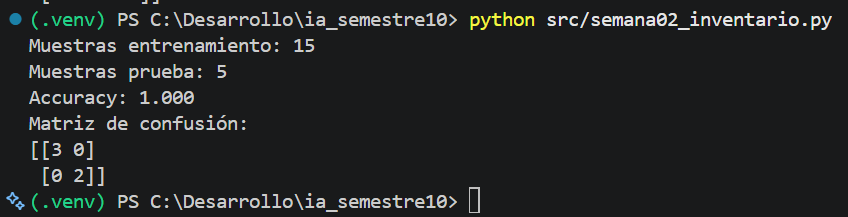

## Aplicación al proyecto

El proyecto seleccionado corresponde al monitoreo visual de inventario, adaptado al contexto de una ferretería.

Durante la Semana 2 todavía no se implementa procesamiento de imágenes, ya que el objetivo de la práctica es comprender los fundamentos del aprendizaje supervisado.

Por esta razón, se construyó una primera línea base para clasificar si un producto necesita reposición utilizando características numéricas como:

- stock actual
- stock mínimo
- ventas en los últimos 30 días
- días sin venta

La variable objetivo es `necesita_reposicion`, donde:

- `0` significa que el producto no necesita reposición.
- `1` significa que el producto necesita reposición.

Se utilizó el mismo flujo trabajado en el ejemplo Iris: separación de datos de entrenamiento y prueba, estandarización, regresión logística, entrenamiento, predicción y evaluación mediante accuracy y matriz de confusión.

Este modelo no representa todavía el funcionamiento final del sistema. En etapas posteriores se incorporará visión artificial para reconocer productos y estimar cantidades a partir de la cámara de un dispositivo móvil.
